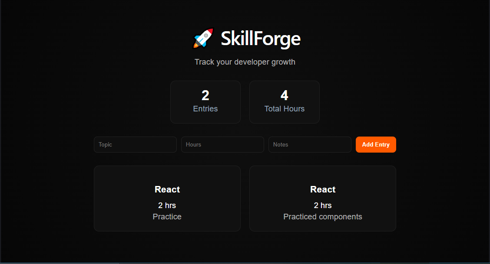
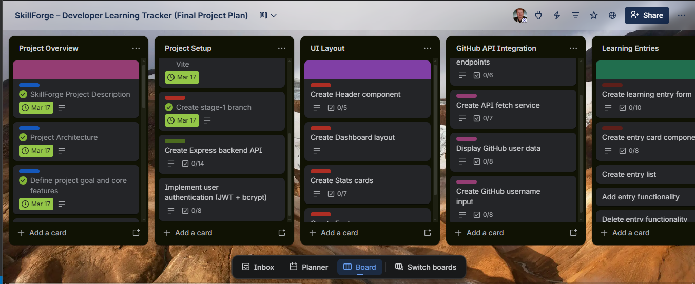

# 🚀 SkillForge – Developer Learning Tracker


---

## 📌 Overview

**SkillForge** is a full-stack web application designed to help developers track their learning progress, monitor consistency, and visualize growth over time.

The application combines **manual learning entries** with **real GitHub data** to provide a complete picture of developer activity and improvement.

---

## 📸 Project Preview



---

## 🌐 Live Project

[View SkillForge Live](https://69beb231345e31ff24148486--euphonious-duckanoo-110dd4.netlify.app/)

---

## 🗂️ Project Planning



---

## ✨ Features

### ✅ Current (Stage 1)

- React frontend initialized and deployed
- Displays learning entries in a structured UI
- Clean and responsive layout
- Project architecture established

### 🔄 Planned Features

#### 📚 Learning Tracker

- Add entries (topic, hours, notes, date)
- View and manage learning history

#### 🐙 GitHub Integration

- Fetch user profile data
- Display repositories and activity
- Analyze languages used

#### 📊 Progress Analytics

- Track hours over time
- Visualize learning trends

#### 🔐 Authentication

- User login/signup
- Secure data storage

---

## 🏗️ Architecture

```text
User (Browser)
   ↓
React Frontend (Vite)
   ↓
Node.js / Express Backend
   ↓
MongoDB Database
   ↓
GitHub API
```

---

## 🧰 Tech Stack

### Frontend

- ⚛️ React (Vite)
- 🎨 CSS / Responsive Design

### Backend (Planned)

- 🟢 Node.js
- 🚏 Express.js

### Database (Planned)

- 🍃 MongoDB

### External API

- 🐙 GitHub REST API

---

## 🔌 API Integration

This project will use the **GitHub REST API**:

- `GET /users/:username`
- `GET /users/:username/repos`
- `GET /users/:username/events`

---

## 📁 Project Structure

```text
skillforge/
├── frontend/
│   ├── src/
│   └── dist/
├── backend/
├── README.md
└── .gitignore
```

---

## ⚙️ Installation & Setup

### 1. Clone the repository

```bash
git clone https://github.com/FHobbs8030/skillforge.git
cd skillforge
```

### 2. Setup Frontend

```bash
cd frontend
npm install
npm run dev
```

### 3. Setup Backend (when implemented)

```bash
cd backend
npm install
npm run dev
```

---

## 📈 Roadmap

### ✅ Stage 1 (Current)

- Project structure setup
- React frontend initialized
- Express backend initialized
- Frontend deployed

### 🔄 Stage 2

- CRUD functionality for learning entries
- MongoDB integration

### 🔄 Stage 3

- GitHub API integration
- Data visualization (charts)

### 🔄 Stage 4

- Authentication (JWT)
- Full deployment

---

## 🎯 Goals

- Build a portfolio-quality full-stack application
- Demonstrate third-party API integration
- Showcase data-driven UI development
- Strengthen backend architecture skills

---

## 📌 Status

🚧 In Development – Stage 1

---

## 👨‍💻 Author

Fred Hobbs

GitHub: <https://github.com/FHobbs8030>
