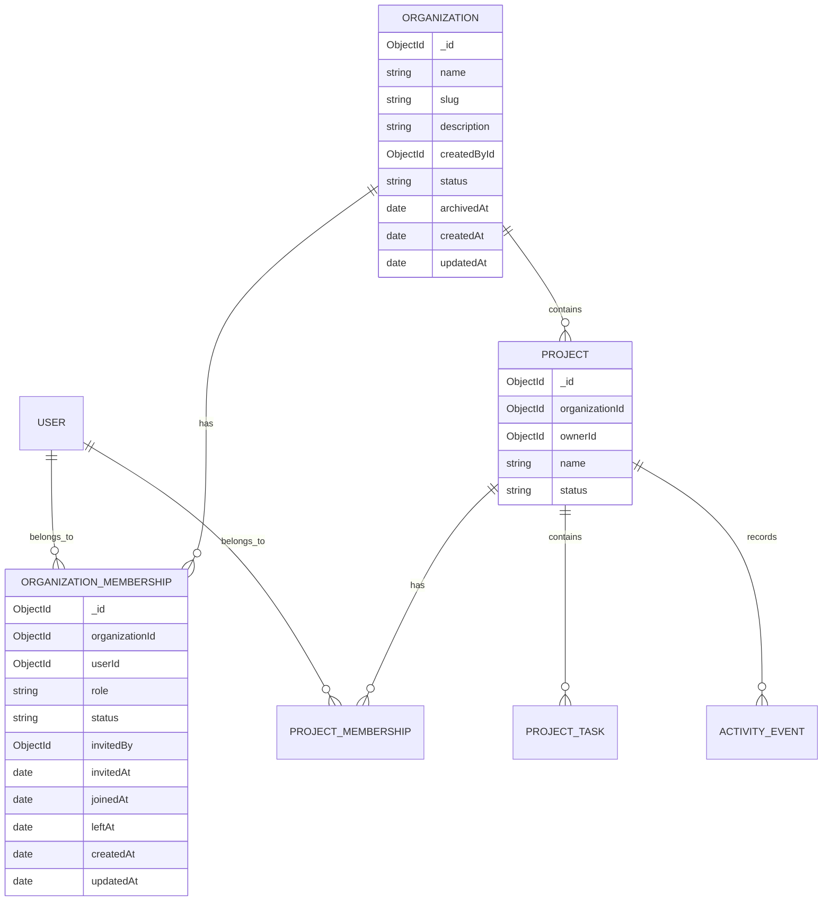

# SkillForge Organization Architecture Checkpoint

**Status:** Approved architecture checkpoint
**Date:** July 25, 2026
**Roadmap position:** Between Phase 3 — Project Task Management and Phase 5 — Organization Foundation

## 1. North Star

SkillForge is a B2B SaaS project collaboration platform for software development companies.

The commercial customer is a company or organization. Employees and development-team members use SkillForge through the organization’s workspace.

The organization—not an individual employee—owns the commercial trial, subscription state, and company-level resources.

## 2. Purpose of This Checkpoint

This document locks the architecture for introducing organizations without prematurely implementing billing, Kanban, artificial intelligence, or unrelated platform features.

This checkpoint defines:

- Organization ownership and lifecycle
- Organization membership and company-level roles
- Organization-scoped projects
- Separation between organization roles and project roles
- Existing-project migration and backward compatibility
- Authorization boundaries
- Future trial and subscription ownership
- Implementation order and acceptance criteria

No production models, routes, or user interfaces are changed during this documentation checkpoint.

## 3. Architecture Principles

### 3.1 Organizations are the commercial account

An Organization represents the company that uses and pays for SkillForge.

Trial and subscription state will belong to the Organization rather than to individual users.

### 3.2 Membership is the authorization source

Organization access is determined through `OrganizationMembership`.

The Organization model will not use an `ownerId` field as a second authorization system. Organization ownership is represented by an active membership with the `owner` role.

The Organization may retain `createdById` for audit history, but `createdById` does not grant permissions.

### 3.3 Organization roles and project roles remain separate

Organization roles:

- `owner`
- `admin`
- `member`

Project roles:

- `owner`
- `host`
- `collaborator`
- `viewer`

An organization role does not automatically become a project role.

Organization membership establishes company-workspace access. Project membership establishes operational access to a specific project.

### 3.4 Existing project authorization remains stable

`ProjectMembership` remains the canonical source for project permissions.

The existing `Project.ownerId` field is retained temporarily for backward compatibility and ownership metadata, but project authorization must continue to rely on active `ProjectMembership` records.

A future migration may remove or redefine `Project.ownerId`, but that change is outside the Organization Foundation phase.

### 3.5 Migration must be explicit and non-destructive

Existing projects will not be silently assigned to a new organization.

Projects created before Organization Foundation remain valid and accessible until an authorized owner explicitly migrates them.

### 3.6 Subscription enforcement will be centralized

Future trial and subscription restrictions must use a shared organization-access policy rather than duplicating billing checks across individual routes.

## 4. Target Entity Relationship



## 5. Organization Model Contract

The initial `Organization` model should contain:

| Field | Type | Requirement |
| --- | --- | --- |
| `name` | String | Required; trimmed; 2–120 characters |
| `slug` | String | Required; lowercase; unique; URL-safe |
| `description` | String | Optional; maximum 1,000 characters |
| `createdById` | ObjectId → User | Required; immutable audit field |
| `status` | Enum | `active` or `archived` |
| `archivedAt` | Date | `null` unless archived |
| `createdAt` | Date | Mongoose timestamp |
| `updatedAt` | Date | Mongoose timestamp |

### Organization identity rules

- MongoDB `_id` is the canonical identifier.
- `slug` is a human-readable lookup value and must not become the authorization boundary.
- Renaming an organization does not automatically need to change its slug.
- Slug changes require owner or admin authorization and uniqueness validation.

### Deferred Organization fields

The following fields are intentionally deferred until the trial/subscription phase:

- Plan identifier
- Trial start and end dates
- Subscription status
- Billing customer identifier
- Billing subscription identifier
- Payment-provider metadata

Provider-specific billing fields must not be introduced before the billing integration phase.

## 6. OrganizationMembership Model Contract

The `OrganizationMembership` model should contain:

| Field | Type | Requirement |
| --- | --- | --- |
| `organizationId` | ObjectId → Organization | Required |
| `userId` | ObjectId → User | Required |
| `role` | Enum | `owner`, `admin`, or `member` |
| `status` | Enum | `invited`, `active`, `inactive`, or `removed` |
| `invitedBy` | ObjectId → User | Optional |
| `invitedAt` | Date | Optional |
| `joinedAt` | Date | Set when activated |
| `leftAt` | Date | Set when inactive or removed |
| `createdAt` | Date | Mongoose timestamp |
| `updatedAt` | Date | Mongoose timestamp |

Required index:

```js
{
  organizationId: 1,
  userId: 1
}
```

This index must be unique.

### Ownership invariants

- Every active organization must have exactly one active owner.
- The owner cannot remove or demote themselves while they are the only owner.
- Ownership transfer must be an explicit operation.
- Ownership transfer should be transactional when transaction support is introduced.
- Archiving an organization does not delete memberships, projects, tasks, or activity history.

## 7. Organization Role Permissions

| Capability | Owner | Admin | Member |
| --- | ---: | ---: | ---: |
| View organization | Yes | Yes | Yes |
| Update organization profile | Yes | Yes | No |
| Invite members | Yes | Yes | No |
| Change member roles | Yes | Limited | No |
| Promote an admin | Yes | No | No |
| Transfer ownership | Yes | No | No |
| Remove members | Yes | Yes, except owner | No |
| Create organization projects | Yes | Yes | No initially |
| Archive organization | Yes | No | No |
| View trial/subscription status | Yes | Yes | Limited |
| Manage billing | Yes | No | No |

An Admin cannot:

- Remove the Owner
- Demote the Owner
- Promote another Owner
- Transfer ownership
- Archive the organization
- Manage billing

## 8. Separation of Organization and Project Permissions

Organization membership does not automatically grant operational access to every project.

Examples:

- An Organization Owner is not automatically a Project Owner.
- An Organization Admin is not automatically a Project Host.
- An Organization Member is not automatically a Project Collaborator.
- A user must have an active `ProjectMembership` to view or modify a specific project’s operational content.

When an Organization Owner or Admin creates a project:

1. The project receives the organization’s ID.
2. The creator receives an active ProjectMembership with the `owner` role.
3. Additional project access is assigned through ProjectMembership.
4. Organization-level administration remains distinct from project execution.

Organization Owners and Admins may later receive access to aggregate company-dashboard information without receiving automatic access to all project content.

## 9. Organization-Scoped Projects

The Project model will gain:

```js
organizationId: {
  type: mongoose.Schema.Types.ObjectId,
  ref: "Organization",
  default: null,
  index: true,
}
```

### Scoping rules

- `organizationId` is nullable during migration.
- `organizationId: null` represents an existing personal or legacy project.
- Projects created through an organization route require `organizationId`.
- An organization-scoped project must reference an active organization.
- Project membership remains required for project-level access.
- Organization-scoped routes must verify both organization context and project relationship.

### Route direction

Organization routes:

```text
POST   /organizations
GET    /organizations
GET    /organizations/:organizationId
PATCH  /organizations/:organizationId

GET    /organizations/:organizationId/members
POST   /organizations/:organizationId/invitations
PATCH  /organizations/:organizationId/members/:membershipId

GET    /organizations/:organizationId/projects
POST   /organizations/:organizationId/projects
```

Existing project routes remain canonical for individual project operations:

```text
GET    /projects/:projectId
PATCH  /projects/:projectId
GET    /projects/:projectId/tasks
POST   /projects/:projectId/tasks
```

Existing project routes must load the project’s organization context when `organizationId` is present.

## 10. Existing Project Migration Strategy

Existing projects must remain functional after Organization Foundation is introduced.

### Migration rules

1. Adding `organizationId` must not require an immediate database backfill.
2. Existing projects begin with `organizationId: null`.
3. Existing project pages and APIs continue working through ProjectMembership.
4. Moving a project into an organization requires an explicit migration operation.
5. Only the active Project Owner may authorize migration.
6. The actor must also be an Organization Owner or Admin.
7. Existing project roles must be preserved.
8. Project members must be reconciled with OrganizationMembership before migration completes.
9. Migration must not delete project history, tasks, memberships, repository settings, or activity events.
10. A project cannot belong to more than one organization.

The exact migration user interface and invitation-consent workflow are deferred until organization-scoped projects are implemented.

## 11. Authorization Architecture

The organization phases should introduce shared authorization helpers rather than repeating membership queries in every route.

Recommended responsibilities:

```text
getActiveOrganizationMembership
requireOrganizationMembership
requireOrganizationRole
requireOrganizationWritable
loadProjectAccessContext
```

### Required authorization context

An organization-aware project request should resolve:

```js
{
  user,
  project,
  projectMembership,
  organization,
  organizationMembership,
  organizationAccessState,
}
```

Not every request will require every value, but authorization decisions should be based on one resolved context rather than disconnected queries.

### Error behavior

Recommended HTTP behavior:

| Condition | Status |
| --- | ---: |
| Invalid identifier | `400` |
| Authentication missing or expired | `401` |
| Membership or inaccessible resource | `404` |
| Authenticated but insufficient role | `403` |
| Archived resource blocks mutation | `409` |
| Trial/subscription blocks mutation | `402` in the subscription phase |

Subscription restrictions should include a stable machine-readable error code such as:

```json
{
  "error": "Organization subscription required.",
  "code": "ORGANIZATION_SUBSCRIPTION_REQUIRED"
}
```

## 12. Trial and Subscription Ownership

Trial and subscription state belongs to the Organization.

It must not belong to:

- A User
- A Project
- An OrganizationMembership
- A ProjectMembership

### Future trial behavior

The intended commercial flow is:

```text
Company creates organization
→ organization receives 30-day trial
→ employees join organization
→ organization creates and manages projects
→ trial expires
→ organization becomes restricted/read-only
→ company activates paid subscription
→ write access is restored
```

### Expired trial behavior

When the future organization trial expires:

- Authentication remains available.
- Organization data remains stored.
- Authorized users can read organization and project data.
- Mutating organization-scoped project operations are blocked.
- Billing and subscription-management operations remain available.
- Data must not be deleted automatically.
- Public demonstration experiences remain unaffected.

Exact pricing, plan limits, payment-provider selection, and card requirements remain undecided.

## 13. Public Demo Compatibility

The existing public Host and Collaborator demos remain no-friction product previews.

They must not:

- Create commercial subscriptions
- Start company trials
- Require organization membership
- Be treated as production organization workspaces
- Alter the organization authorization model

## 14. Implementation Order

### Phase 5 — Organization Foundation

Deliver:

- Organization model
- OrganizationMembership model
- Create organization
- List current user’s organizations
- Read organization detail
- Update organization profile
- Archive organization
- Atomic creation of the creator’s Owner membership
- Validation and authorization tests

### Phase 6 — Organization Membership

Deliver:

- Organization member directory
- Invite member
- Accept or decline invitation
- Owner, Admin, and Member authorization
- Promote and demote eligible members
- Remove or deactivate members
- Ownership-transfer safeguards
- Organization membership activity events

### Phase 7 — Organization-Scoped Projects

Deliver:

- Nullable `Project.organizationId`
- Organization project listing
- Organization project creation
- Project creator receives Project Owner membership
- Organization and project authorization context
- Legacy-project compatibility
- Explicit project migration foundation

### Later phases

After organization scoping:

- Task Management UI
- Kanban Workspace
- Company Dashboard
- Thirty-day trial and subscription state
- Billing integration
- Production SaaS polish

## 15. Acceptance Criteria for This Checkpoint

This architecture checkpoint is complete when:

- Organization is confirmed as the commercial account.
- OrganizationMembership is confirmed as organization authorization source.
- Organization and project roles are explicitly separated.
- Existing ProjectMembership authorization remains intact.
- Project organization scoping is nullable during migration.
- Existing projects remain backward compatible.
- Trial and subscription state is assigned to Organization.
- Expired-trial behavior is defined as restricted/read-only.
- Billing implementation remains deferred.
- Public demos remain separate from the commercial model.
- Phase 5, Phase 6, and Phase 7 implementation order is locked.
- No production code is changed in this checkpoint.

## 16. Deferred Decisions and Parking Lot

The following are not part of Organization Foundation:

- Exact subscription pricing
- Subscription plan names and limits
- Billing provider
- Card requirement during trial
- Single sign-on
- Slack or Microsoft Teams integration
- Artificial intelligence features
- Native mobile applications
- Recruiting or freelance marketplace features
- Payroll
- Video calling
- Real-time chat
- Advanced compliance controls
- Multi-organization enterprise administration

These items require separate approved plan changes or later roadmap phases.

## 17. Locked Architecture Decision

SkillForge will evolve from user-owned standalone projects into organization-owned company workspaces without invalidating existing projects.

The canonical hierarchy is:

```text
Organization
→ OrganizationMembership
→ Project
→ ProjectMembership
→ ProjectTask
→ ActivityEvent
```

Commercial ownership is organization-level.

Operational project access remains project-membership-level.

This separation is the foundation for SkillForge’s B2B SaaS architecture.
